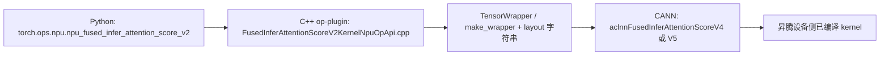
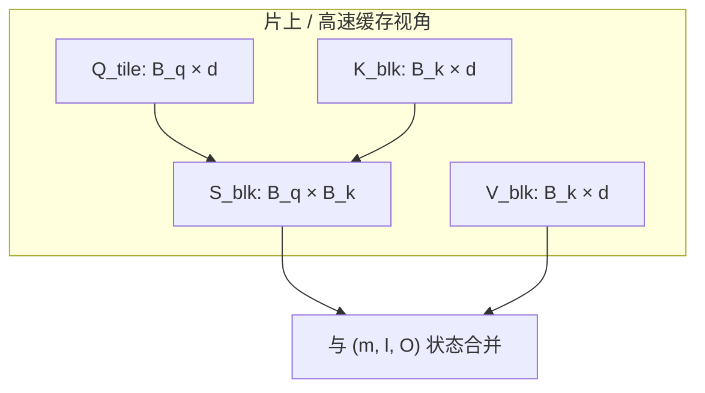
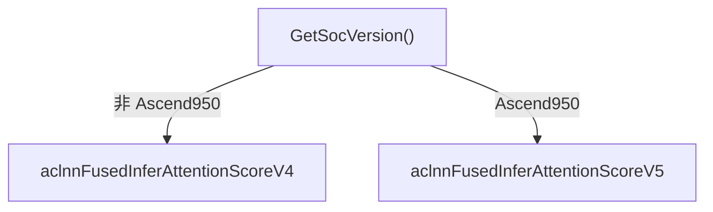

# 融合推理注意力（FusedInferAttentionScore V2）与 Tiling 说明

本文整理自对 Ascend **op-plugin** 中 `FusedInferAttentionScoreV2KernelNpuOpApi.cpp` 的解读，以及注意力公式、融合算子与 **tiling** 的关系。

源码参考：[Ascend/op-plugin — `op_plugin/ops/opapi/FusedInferAttentionScoreV2KernelNpuOpApi.cpp`](https://github.com/Ascend/op-plugin/blob/master/op_plugin/ops/opapi/FusedInferAttentionScoreV2KernelNpuOpApi.cpp)。

---

## 1. 在软件栈里的位置

**本文件职责（概括）**：解析布局 → 推导输出形状与 dtype → 包一层 `TensorWrapper` → 按 SoC 选择 **V4/V5** 调 ACLNN。

**不在这里实现**：$\mathrm{softmax}(QK^\top) V$ 的循环展开、分块（tiling）、算子流水；这些在 **CANN / ACLNN** 内部完成。

---

## 2. op-plugin 文件内的主要逻辑模块

### 2.1 布局：`input_layout` → 内部 query / 输出布局

- `get_query_and_attention_out_layout` 中维护 **`LAYOUT_MAP`**：将诸如 `BNSD_BSND` 等字符串映射为 **query 实际布局**、**attention 输出布局**、**query 维数**（3 或 4），并与 `query.dim()` 校验。

### 2.2 形状推导辅助函数

- **`get_query_b_n_s_d`**：`BSH` / `BSND` / `BNSD` / `NSD` 下从 `query` 推出 B、N、S、D（`BSH` 时 $d = H/\mathrm{num\_heads}$）。
- **`get_query_t_n_d`**：`TND` / `NTD` 下推出 T、N、D。
- **`get_value_d`**：有/无 `block_table`（PageAttention）时，从 `value` 维推出 head 维 **D**；PA 允许 value 为 3/4/5 维。
- **`get_change_d_scale_v2`**：对打包 dtype（如 int4 存 int32、FP4 存 uint8）对 **valueD 做倍数修正**，以便输出维度与存储宽度一致。

### 2.3 输出与 LSE

- **`infer_attention_out_shape`**：按 `attention_out_layout`（BSH、BSND、BNSD、NBSD、TND、NTD、NSD 等）构造主输出张量形状。
- **`infer_lse_out_shape`**：若 `return_softmax_lse`，TND/NTD 等为 `[T,N,1]` float，否则多为 `[B,N,S,1]` float；否则 `softmax_lse` 为 `{0}` 占位。

### 2.4 总装配与入口

- **`construct_fia_output_tensor_v2`**：汇总上述步骤，确定 **output / softmax_lse** 的形状与 dtype（量化、`quant_scale_out`、`out_dtype`、`query_rope` 等分支）。
- **`npu_fused_infer_attention_score_v2_symint`**：构造输出 → `make_wrapper` → **非 Ascend950** 调 `aclnnFusedInferAttentionScoreV4`，**Ascend950** 调 `aclnnFusedInferAttentionScoreV5`（V1–V4 在 950 上不再支撑）。V5 相对 V4 在参数上有差异（如 `quant_scale_p`、`default_q_start_idx` / `default_kv_start_idx` 等）。
- **`npu_fused_infer_attention_score_v2_out_symint`**：使用调用方预分配的 `attention_out` / `softmax_lse`，可选 **workspace**（`EXEC_UPDATE_NPU_NO_FORMAT_CHECK_CMD`）。
- **`_npu_fused_infer_attention_score_v2_get_max_workspace_symint`**：用相同元数据调用 `EXEC_GET_MAX_WORKSPACE_CMD` 查询 workspace 大小。
- **`_npu_fused_infer_attention_score_v2_infer_output`**：仅输出形状推断，不调 ACLNN。

---

## 3. 数学：算子在算什么

单头、忽略 mask / RoPE 写法：

$$
\mathrm{Attn}(Q,K,V) = \mathrm{softmax}\left(\frac{QK^\top}{\sqrt{d}}\right) V
$$

- $Q$ 与 $K,V$ 可为 $[S_q,d]$、$[S_k,d]$（多 batch/多头为外再多维索引）。
- **`softmax_scale`** 在实现中可吸收 $\sqrt{d}$ 或其它缩放。
- **Log-sum-exp**：数值稳定时常按行维护 $\max$ 与 $\log\sum\exp$；若 `return_softmax_lse`，由底层写入 LSE 相关张量；op-plugin 只分配形状。

**GQA/MQA**：`num_key_value_heads` 可小于 `num_query_heads`，数学上仍是「得分矩阵 + softmax + 乘 V」，K/V 在 head 维按实现做广播/分组。

**PageAttention**：K/V 在 paged cache 中，通过 `block_table` 映射逻辑 token；公式不变，**访存与 tiling 对齐**随块/页变化。

---

## 4. 为何「不 tiling」时有问题；tiling 在解决什么

朴素流程：先算完整 $S = QK^\top$（形状约 $[S_q,S_k]$），再 softmax，再乘 $V$。

- **算力**量级约 $O(S_q S_k d)$，与好实现同阶。
- **问题**：完整 $S$ 的 **HBM 占用与读写** 为 $O(S_q S_k)$，长序列时暴涨，**算术强度**（FLOPs/Byte）变差。

**Tiling 目标**：在 **片上高速缓冲** 内分块完成「算分 → softmax（或等价变换）→ 乘 V」，**不把整表 $S$ 长期落在 HBM**；跨块用 **online softmax** 与全局 softmax **等价**（浮点舍入外）。

---

## 5. Tiling 概念：切哪些维

常见 **FlashAttention 式**结构：

- 沿 **query 序列** 取块：**$B_q$**
- 沿 **key/value 序列** 取块：**$B_k$**

在单个 KV 块内算 $S^{\mathrm{blk}} = Q_{\mathrm{tile}} K_{\mathrm{blk}}^\top$（仅 $[B_q,B_k]$），再与块内 $V_{\mathrm{blk}}$ 结合；大行 softmax 需 **跨块合并**（见下节）。

**Head 维 $d$** 也可再分块做点积累加；**batch/多核** 是在此外层并行。

**因果 / band / sparse**：决定 **哪些块参与计算**；tiling 描述 **块内如何算**。

**融合**：尽量少次写回 HBM；量化路径上还可融合反量化/再量化，tiling 需兼顾 scale 的块级行为。

---

## 6. Online softmax（跨块合并，直觉）

对固定行 $i$，全局：

$$
P_{ij}=\frac{\exp(S_{ij}-m_i)}{\sum_{j'}\exp(S_{ij'}-m_i)},\quad m_i=\max_{j'} S_{ij'}
$$

按 KV 块依次处理时，每行维护 **当前全局 max $m$**、**归一化因子 $\ell$**（与 $\exp$ 和相关）、**部分输出 $O$**。来新块时更新全局 $m$，并对旧的 $\ell$、$O$ 做 $\exp(m^{\mathrm{old}}-m^{\mathrm{new}})$ 形式的缩放，再加上本块贡献。这样 **无需**在 HBM 上存完整 $S$ 或完整 $P$。

---

## 7. V4 / V5 在 op-plugin 中的分叉（实现边界）

具体 **tile 大小、缓冲层级、流水** 由 CANN 闭源实现决定；op-plugin 不暴露。

---

## 8. 自学建议

1. 阅读 FlashAttention / FlashAttention-2 原文：KV 块循环与 HBM 访问量级。
2. 手写推导 **两块两行** 的 $m,\ell,O$ 更新。
3. 对照 **当前 CANN 版本** 文档中 `FusedInferAttentionScore` 的 layout、sparse、PA、量化及 `block_size` / `inner_precise` 等含义。
4. 用小 shape 做实验观察 latency/占用（若文档表明 `block_size` 影响 kernel）。

---

## 9. 免责声明

本文档为学习与概念整理；**具体 Ascend 硬件 tiling 参数与 ACLNN 行为以华为 CANN 官方文档与发行说明为准。**
